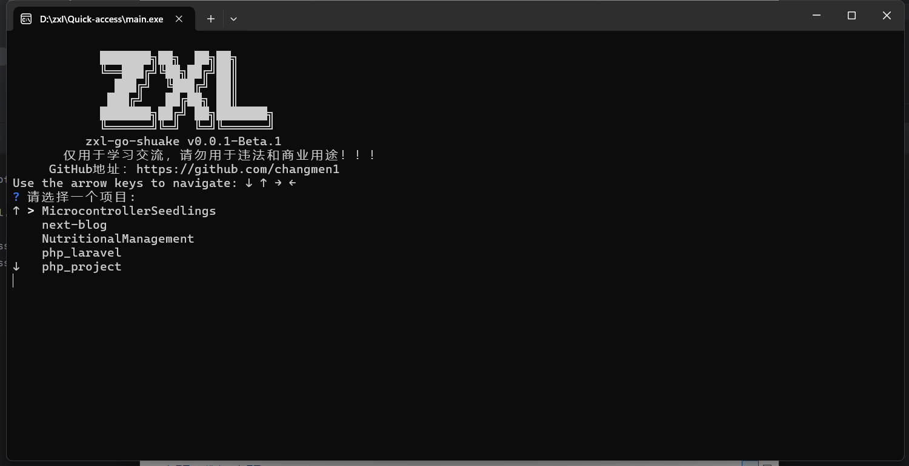

# GitHub 项目命令行工具

## 项目简介
GitHub 快速访问终端是一个基于 Go 语言开发的命令行工具，旨在帮助用户快速获取 GitHub 账号下的仓库（包括私有仓库），并在终端中进行选择和访问。

该工具支持：
- 通过 GitHub API 获取用户的仓库列表
- 交互式选择仓库
- 直接在浏览器中打开选中的 GitHub 仓库

## 功能特性
- **支持私有仓库访问**：使用 GitHub Token 进行身份验证，确保访问权限。
- **交互式选择**：用户可以从自己的仓库列表中选择目标仓库。
- **快捷访问**：选定仓库后，程序会自动在默认浏览器中打开。

## 环境要求
- Go 1.18 及以上版本
- GitHub 个人访问令牌（PAT）

## 安装与运行
### 1️⃣ 克隆仓库
```sh
 git clone https://github.com/yourusername/Quick-access.git
 cd Quick-access
```

### 2️⃣ 配置 GitHub Token
在项目根目录下创建一个 `.env` 文件，并添加你的 GitHub Token（**请勿泄露你的 Token！**）：
```env
GITHUB_TOKEN=your_github_personal_access_token
```

### 3️⃣ 安装依赖
```sh
go mod tidy
```

### 4️⃣ 运行项目
```sh
go run main.go
```

### 4️⃣ 编译可执行文件
```sh
go build main.go
```

### 4️⃣ 终端


## 使用方法
1. 运行 `go run main.go` 启动程序。
2. 终端会显示你的 GitHub 仓库列表。
3. 使用键盘选择你想访问的仓库。
4. 选中后，默认浏览器会打开对应的 GitHub 页面。

## 代码结构
```plaintext
📂 Quick-access
├── 📄 main.go        # 入口文件，调用 GitHub 访问逻辑
├── 📄 github.go      # 处理 GitHub API 交互
├── 📄 .gitignore     # 忽略不必要的文件
├── 📄 go.mod         # Go 依赖管理文件
├── 📄 go.sum         # 依赖锁定文件
└── 📄 README.md      # 项目说明文档
```

## 注意事项
- **请勿将 `.env` 文件提交到 GitHub**，可以在 `.gitignore` 文件中添加 `.env` 以忽略提交。
- 如果 GitHub API 访问失败，请检查你的 Token 是否正确或已过期。

## 许可证
本项目基于 MIT 许可证，欢迎自由使用和修改。

---

🚀 **快来试试 GitHub 快速访问终端，让你的 GitHub 仓库管理更加便捷！**